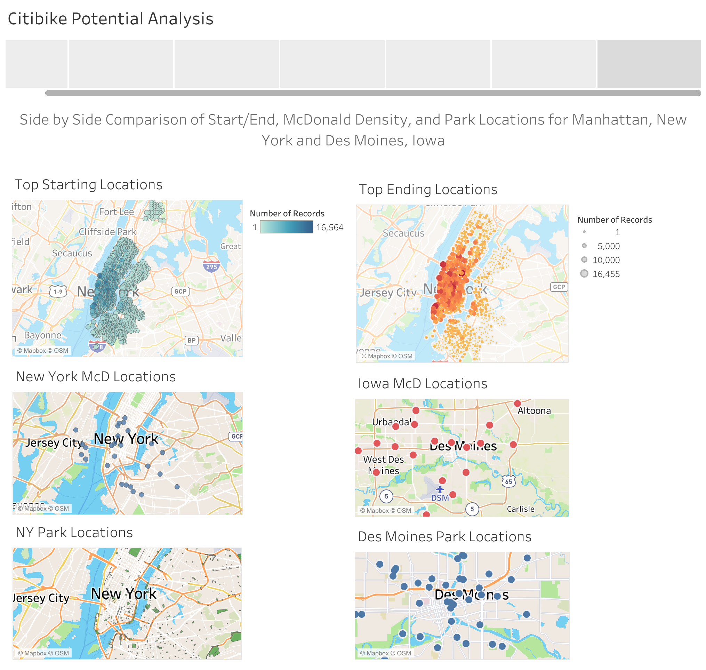

# NYC Citi Bike Analysis
##  Taking a look at the correlation between McDonald Density and bike usage for Manhattan and Des Moines
### We will take things one step further by analyzing parks and their proximity to citibike usage

#### Summary
In doing the research and assembly of the story created about the New York citibike data, I made a few interesting discoveries. 
The first of these discoveries relates to the density of McDonalds locations compared to citibike start and stop locations. 

 

The locations of a vast majority of starts and stops using the citibike were centered on the Manhattan area. Looking on the map, 
there a number of reasonable tourist attractions concentrated in this area. It made sense that the majority of McDonald locations 
were also around these attractions and thus found a majority being in Manhattan. In this way, we can see that there may be a direct
correlations between McDonald locations and where tourists end up using their citibikes. Unfortunately, Des Moines has no particular 
concentrations of McDonalds in any one area. If we base our assumptions for potential citibie service based on McDonald Density and 
what was witnessed of New York, it is unlikely that Des Moines is a source of tourism that the citibike could benefit from in the same way. 

Looking at the previous conclusion, I thought that it might be good to do another analysis of both cities using another factor, park land. 
When comparing the New York park land to the stop locations, we see that the stop locations tend to end around many park areas. Considering 
this and the abundance of parks in Des Moines, it might be wise to consider a redesign or rebranding of the citibike to have a park emphasis 
to attract more users/tourists of the service in this area upon implementation. 

#### Story By Sheet Summary
- Sheet 1: Top Starting locations for citibike in New York 
- Sheet 2: Top Ending locations for citibike in New York
- Sheet 3: Locations of McDonalds in New York
- Sheet 4: Locations of McDonalds in Des Moines, Iowa
- Sheet 5: Parkland in New York 
- Sheet 6: Parkland in Des Moines, Iowa
- Sheet 7: Comparison of each of the previous pages for better view

[link to dashboard](https://public.tableau.com/profile/nicholas.lambert#!/vizhome/tbchallengech14/CitibikePotentialAnalysis?publish=yes "Link to dashboard")
